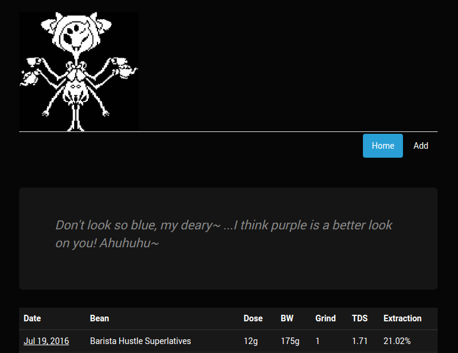

# Muffet 

Muffet is a web application for logging and analyzing filter coffee brewing data.  It includes a web front end and REST API to the database.

# Installation

Muffet requires a locally listening [MongoDB](https://docs.mongodb.com/manual/installation/) on default port 27017.

Clone the github repo and then run 

```
npm install
node app.js
```

# Technologies Used

* Node.js
* MongoDB
* AngularJS
* Express
* Mongoose
* Bootstrap

# Screenshots



# Credits

The code borrows heavily from the Udemy [node.js tutorial](https://blog.udemy.com/node-js-tutorial/) and the book [Web Development with MongoDB and Node.js](https://www.packtpub.com/web-development/web-development-mongodb-and-nodejs).

The name was inspired by the best character in [Undertale](http://undertale.com/).
